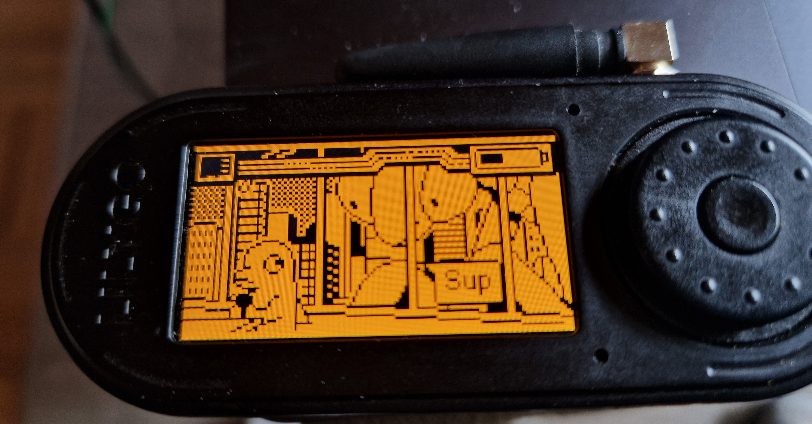
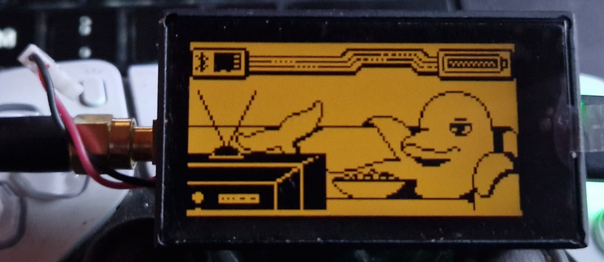

# Flipper Zero ESP32 Port

A port of the [Flipper Zero](https://flipperzero.one/) firmware to ESP32-based development boards. It brings the Flipper Zero UI, services, and application framework to affordable ESP32 hardware, with no Flipper Zero required.

> [!CAUTION]
> **Do not flash "L15Dev" / "Bitwire" firmware.**
> A build distributed under the name "L15Dev" / "Bitwire" has been reported to contain malware and a backdoor. Do not download, flash, or run it.
>
> Use only the official builds from this repository or the [web flasher](https://sor3nt.github.io/interface.html). If you already flashed an "L15Dev" image, re-flash a clean official build and treat any credentials or data on the device (WiFi passwords, captures) as compromised.

> [!WARNING]
> This project is for educational purposes only. You are responsible for any damage to your board or property. Proceed at your own risk.

---

## Community

Join the [Flipper Zero meets ESP32 Discord](https://discord.gg/5DnAqFXaBC) for support and announcements.

---

## Supported Boards



| Board | MCU | Display | Input | SubGHz | NFC | IR | SD Card |
|---|---|---|---|---|---|---|---|
| LilyGo T-Embed CC1101 | ESP32-S3 (Xtensa LX7) | ST7789 320x170 | Rotary encoder + button | CC1101 | PN532 (I2C) | RMT TX + RX | SPI |
| Waveshare ESP32-C6-LCD-1.9 | ESP32-C6 (RISC-V) | ST7789V2 320x172 | CST816S touch | No | No | No | SPI |
| Waveshare ESP32-C6-LCD-1.47 | ESP32-C6 (RISC-V) | JD9853 320x172 | AXS5106L touch | No | No | No | SPI |
| DIY ESP32-S3 with 2.8" TFT | ESP32-S3 (Xtensa LX7) | ILI9341 320x240 | 6x tactile buttons | CC1101 | PN532 (I2C) | TX | SPI |

> [!NOTE]
> **Waveshare ESP32-C6-LCD-1.47: supported but barely usable.** The board builds, boots, and the UI/touch work, but the ESP32-C6 has only 512 KB SRAM and no PSRAM. RAM-heavy apps are effectively non-functional. In particular, WiFi: a normal AP scan works, but monitor mode and handshake capture fail. By the time the app's buffers are allocated, the WiFi driver can no longer allocate its DMA buffers (`esf_buf_setup_static: alloc eb fail`, `ESP_ERR_NO_MEM`), so no frames are received. Treat this board as usable only for lightweight apps until the WiFi app's memory footprint is reduced (it was designed for the PSRAM-equipped T-Embed).

> [!NOTE]
> **DIY ESP32-S3 with 2.8" TFT:** supported via a fork pending full integration. Work in progress. Ready-to-flash binaries are also available in the Discord, updated each release.



---

## How to Flash

The easiest way is the web flasher. No toolchain required, just a Chrome or Edge browser and a USB cable.

**[Flash via Browser](https://sor3nt.github.io/interface.html)**

Connect your board, click flash, done. After flashing, copy the contents of [sdcard.zip](https://github.com/Sor3nt/Flipper-Zero-ESP32-Port/releases/download/v1.1.6/sdcard.zip) onto a FAT32 SD card and insert it. Most apps need files there to function.

---

## Apps

### Wireless and RF

<details>
<summary><b>Sub-GHz</b></summary>

External CC1101 receiver and transmitter for 433 to 868 MHz signals.

- Receive and decode
- Read RAW: capture unknown waveforms to `.sub` files for later analysis
- Frequency analyzer with sweep and live RSSI
- Hopper: scan all preset bands during receive
- Transmit saved files, plus manual signal creation (frequency, modulation, protocol, key/serial/counter)
- Brute force and sub-brute attack with manufacturer dictionary
- Playlist for sequential transmit
- TPMS decoding for tire-pressure sensors: Schrader GG4, Citroen, Ford, Renault, Toyota (PMV107J), and a generic decoder, with a dedicated info view and editable sensor data
- Limitation: AES-encrypted manufacturer keystores (`keeloq_mfcodes`, `nice_flor_s`, `alutech_at_4n`) are not decryptable on this port. Only the plain-text `keeloq_mfcodes_user` works for Keeloq decoding.

</details>

<details>
<summary><b>Sub-GHz Remote</b></summary>

Multi-button remote layouts that batch saved `.sub` files. Map Up, Down, Left, Right, and OK to individual transmit signals, and switch between persistent remote profiles.

</details>

<details>
<summary><b>WiFi</b></summary>

Full WiFi pentest toolkit.

- Scanner: SSID, BSSID, channel, RSSI, auth mode
- Connect: auto-detect WPA/WPA2/WPA3, password input or saved password lookup (`/ext/wifi/<ssid>.txt`)
- Deauther: SSID mode (single AP) or Channel mode (all on channel)
- Sniffer: capture packets to PCAP
- Handshake capture: record EAPOL 4-way handshakes, optionally with a deauth trigger
- AirSnitch: auto-bruteforce a target with a password list
- Beacon Spam: funny SSIDs, Rickroll, Random, or Custom
- Network Scan and Port Scan: host discovery plus a 19 common-port probe on the connected network
- Web Crawler: domain-based web crawler
- Evil Portal: captive portal with credential harvesting
  - Built-in templates: Google login, Router firmware update
  - Custom templates from `/ext/wifi/evil_portal/login_template/*.html` and `/ext/wifi/evil_portal/router_template/*.html` (filename becomes the template name in the dropdown)
  - Marker substitution: `%ERROR%`, `%SSID_OPTIONS%` (live AP scan)
  - Router-style verify flow: dropdown of real SSIDs, live WLAN re-auth check, captured-credentials screen on success, retry with error banner on fail
  - Pause and resume the AP from the run screen
  - Captured credentials saved to `/ext/wifi/evil_portal/<ssid>_creds.csv`
  - Internet bridge (new): optional STA uplink with NAPT and DNS forwarding so victims get real internet behind the portal, plus iOS captive-portal "Success" handling. Uplink SSID and password configured in-app.

</details>

<details>
<summary><b>Mesh / Buddy (ESP-NOW)</b></summary>

Pair cheap headless ESP32 boards (buddies) to the T-Embed (master) over ESP-NOW to offload WiFi capture and run remote actions.

- Buddy discovery, pair/remove, and live status from the lock menu, under Mesh Clients
- Device Identify: make a paired buddy blink to locate it
- WiFi handshake capture: a buddy passively captures EAPOL handshakes on a chosen channel (1 to 13)
- Store-and-forward: the buddy holds each complete handshake (M1 to M4 plus beacon) durably (RAM and NVS) per BSSID and delivers it as one acknowledged unit, surviving master absence and buddy reboots
- One `.pcap` per network written to `/ext/wifi/buddy_<name>_<ssid>.pcap`, with a "Handshake received" overlay on all mesh views
- Buddy firmware ships in this repo under [`buddy_firmware/`](buddy_firmware/), a standalone headless ESP-IDF project

</details>

<details>
<summary><b>Bluetooth</b></summary>

- BLE Spam: Apple Continuity (Pair/Action/NotYourDevice), Google FastPair (455+ models), Microsoft SwiftPair, Samsung Buds and Watch, Xiaomi QuickConnect
- BLE Walk: passive scanner with GATT service and characteristic inspection
- BLE Clone (dev): replicate active BLE advertisements
- FindMy: emulate Apple AirTag, Samsung SmartTag, and Tile beacons (clone or generate keypairs)
- HID: keyboard, mouse, and media remote over BLE (see below)
- Bad USB: via USB or BLE

</details>

<details>
<summary><b>NRF24 (2.4 GHz, external nRF24L01)</b></summary>

- Spectrum analyzer: live 2.4 GHz channel activity
- Jammer (rewritten): one engine with switchable channel sources (Protocol, Manual, WiFi, Activity scan), strategies (CW, Flood, Turbo), and presets. Configuration persists per source.
- MouseJacker: inject keystrokes into vulnerable wireless mice and keyboards
- Also available as a FAP (`nRF24_jammer`)

</details>

<details>
<summary><b>Infrared</b></summary>

RMT-based TX and RX.

- Learn signals (auto-decoded or raw)
- Browse, edit, and send saved remotes
- Universal remotes: TV, AC, audio, projectors, fans, LED controllers (databases on SD)
- Brute force category-based databases
- Configurable IR pin and 5 V GPIO power
- Protocols: NEC, NEC42, Samsung32, RC5/RC5X, RC6, SIRC 12/15/20, Kaseikyo, RCA, Pioneer

</details>

---

### NFC

<details>
<summary><b>NFC (PN532 over I2C)</b></summary>

- Read, save, emulate, and write NFC cards and tags
- Manual card generation (custom UID/ATQA/SAK)
- Mifare Classic dictionary attack (system and user dictionaries)
- Mifare Ultralight-C dictionary unlock
- ISO15693 SLIX unlock with manual or stored DEF key
- FeliCa system info, MIFARE DESFire app inspection, EMV transaction history
- 14 supported protocols: ISO14443-3A/3B/4A/4B, ISO15693-3, FeliCa, MIFARE Classic/Ultralight/Plus/DESFire, SLIX, ST25TB, NTAG4xx, Type-4
- 30+ supported card auto-parsers (Charlie Card, Clipper, EMV, Gallagher, HID, Opal, Skylanders, Troika, and more)

</details>

<details>
<summary><b>Passy (FAP)</b></summary>

Biometric passport (MRTD) reader. Reads and displays data groups from ePassports over NFC. Shipped as a prebuilt FAP in [sdcard.zip](https://github.com/Sor3nt/Flipper-Zero-ESP32-Port/releases/download/v1.1.5/sdcard.zip).

</details>

<details>
<summary><b>TagTinker (FAP)</b></summary>

Infrared ESL (Electronic Shelf Label) research toolkit. Transmits custom images and text to graphics tags via IR. RLE streaming, an Android companion app for image editing, and monochrome plus accent-color support.

</details>

---

### HID and USB

<details>
<summary><b>Bad USB</b></summary>

HID payload runner for Ducky-script (`.txt`) files from `/ext/badusb/`.

- 16+ Ducky commands (DELAY, STRING, REPEAT, HOLD/RELEASE, MEDIA keys, mouse, ALT-CHAR/ALT-STRING, SYSRQ)
- Layouts under `/ext/badusb/assets/layouts/*.kl` (around 30 included)
- Configurable USB VID/PID and device name
- BLE bonding with custom MAC and PIN-verify pairing
- Mouse movement, scroll, and button emulation, plus per-character typing delay
- Transport: USB OTG (TinyUSB) on T-Embed, BLE on Waveshare

</details>

---

### System and Tools

<details>
<summary><b>Lock Menu / System Toggles</b></summary>

The desktop lock menu doubles as the central system control panel (board-dependent, scrollable).

- qFlipper: enable the qFlipper desktop bridge (VID/PID spoof plus CDC RPC) so the official qFlipper app can connect (USB-OTG boards)
- USB Storage: expose the SD card as a USB mass-storage device (USB-OTG boards)
- Bluetooth: toggle BLE on or off
- Mesh Clients: buddy discovery and control (see Mesh / Buddy above)

</details>

<details>
<summary><b>Archive</b></summary>

SD-card file browser with tabs per media type: Favorites, Sub-GHz, NFC, LF-RFID, Infrared, iButton, Bad USB, U2F, Apps, Internal, Browser. Pin and unpin favorites, plus copy, paste, rename, delete, and create folder.

</details>

<details>
<summary><b>JS Runner</b></summary>

mJS-based JavaScript runtime for user scripts in `/ext/apps/Scripts/*.js`.

- Available modules: `gui` (loading/menu/dialogs/text and byte input/popup/file picker/widget), `notification`, `math`, `storage`, `event_loop`, `subghz`, `infrared`, `badusb`, `blebeacon`
- Excluded on this port (need HAL porting): `js_serial`, `js_gpio`, `js_i2c`, `js_spi`

</details>

---

### Games

<details>
<summary><b>Doom</b></summary>

Full DOOM port. Place `doom1.wad` at `/ext/apps_data/doom/doom1.wad`. Encoder turns, click fires (short) or walks forward (long). The side button uses doors and switches (short) or opens the menu (long).

</details>

<details>
<summary><b>Snake</b></summary>

Classic snake game.

</details>

---

### Settings and General

Bluetooth, backlight, clock, dolphin/passport, expansion port, input, notification, power, storage, system info, and factory reset. Animated dolphin desktop on idle. File-pack manifest at `/ext/Manifest` (a qFlipper-style asset list whose presence suppresses the "No DB" boot animation).

---

## SD Card Layout

| Path | Used by |
|---|---|
| `/ext/Manifest` | Desktop (presence check) |
| `/ext/dolphin/` and `manifest.txt` | Idle animations |
| `/ext/apps_assets/nfc/plugins/` | NFC protocol plugins (.fal) |
| `/ext/apps_data/nfc/plugins/` | NFC card-parser plugins (.fal) |
| `/ext/apps_data/js_app/plugins/` | JS module bindings (.fal) |
| `/ext/apps_data/doom/doom1.wad` | Doom |
| `/ext/badusb/` | Bad USB scripts and `assets/layouts/*.kl` |
| `/ext/infrared/assets/` | Universal remote DBs (`tv.ir`, `ac.ir`, `audio.ir`, `projectors.ir`, `fans.ir`, `leds.ir`) |
| `/ext/lfrfid/assets/iso3166.lfrfid` | LF-RFID country code lookup |
| `/ext/nfc/assets/` | MIFARE and EMV dictionaries |
| `/ext/subghz/assets/` | SubGHz keystores and `dangerous_settings` |
| `/ext/u2f/assets/` | U2F cert and key |
| `/ext/wifi/<ssid>.txt` | Saved WiFi passwords |
| `/ext/wifi/buddy_<name>_<ssid>.pcap` | Mesh/Buddy handshake captures |
| `/ext/wifi/evil_portal/login_template/` | Custom captive-portal templates (no verify) |
| `/ext/wifi/evil_portal/router_template/` | Custom captive-portal templates (with WLAN verify) |

A complete starter kit is in [sdcard.zip](https://github.com/Sor3nt/Flipper-Zero-ESP32-Port/releases/download/v1.1.5/sdcard.zip). Extract it onto a FAT32 SD card.

---

## Building

### Prerequisites

- [ESP-IDF v5.4.1](https://docs.espressif.com/projects/esp-idf/en/v5.4.1/esp32s3/get-started/) (exact version required)
- ESP-IDF export script sourced (default: `~/esp/esp-idf/export.sh`)

### Build and Flash (Linux / macOS)

```bash
# T-Embed (auto-detects /dev/cu.usbmodem*)
./buildAndFlash_T-Embed.sh

# Build only
./buildAndFlash_T-Embed.sh --build-only

# Waveshare ESP32-C6
./buildAndFlash_Waveshare_c6_1.47.sh
./buildAndFlash_Waveshare_c6_1.9.sh
```

### Build and Flash (Windows)

Use `winbuild.py`, a single CLI that wraps build, flash, and serial-monitor steps for `cmd.exe` and PowerShell. Requires Python 3 and ESP-IDF v5.4.1 installed at `C:\Espressif\frameworks\esp-idf-v5.4.1` (or override via `ESP_IDF_DIR`).

```bat
:: One-time: install the ESP-IDF Python env
python winbuild.py setup

:: Verify the toolchain activates
python winbuild.py check

:: Build T-Embed CC1101 (default board)
python winbuild.py build

:: Build Waveshare ESP32-C6
python winbuild.py build --board waveshare_c6

:: Flash (port defaults to %ESPPORT% or COM14)
python winbuild.py flash --port COM14

:: Stream serial output for N seconds
python winbuild.py monitor --duration 30

:: Build, flash, and monitor in one go
python winbuild.py all --port COM14
```

Boards: `t_embed` (default), `esp32s3`, `waveshare_c6` (or `waveshare_c6_1.9`), `waveshare_c6_1.47`. Override defaults with the `ESP_IDF_DIR` and `ESPPORT` environment variables. `monitor --reset` works only on USB-UART bridges, not on the ESP32-S3 native USB-Serial/JTAG. Use `flash` or `all` to capture boot logs.

### Build a FAP

```bash
# Firmware must be built first (Linux / macOS)
./buildFap.sh applications/main/my_app
```

---

## Porting Approach

This port preserves the original Flipper Zero architecture as closely as possible.

- Furi OS runs on FreeRTOS with the same thread, mutex, event, and record API
- Services (GUI, Input, Storage, Loader, Desktop, BT) use the same message-queue and record-system patterns
- The HAL maps STM32 peripherals to ESP-IDF drivers (SPI to `esp_lcd`, I2C to CST816S/PN532, RMT to IR, Bluedroid to BLE, TinyUSB to USB-HID)
- The display renders the original 128x64 mono framebuffer, then upscales 2x to RGB565 for the color LCD
- Applications compile with minimal changes (`#include` path adjustments, plus no-op stubs for missing hardware like 1-Wire)
- `malloc` is redefined to `calloc`, since the STM32 heap starts zeroed but the ESP32 heap does not
- Crypto is stubbed (no Flipper-Enclave key), which affects encrypted SubGHz keystores. Everything else uses real mbedtls.
